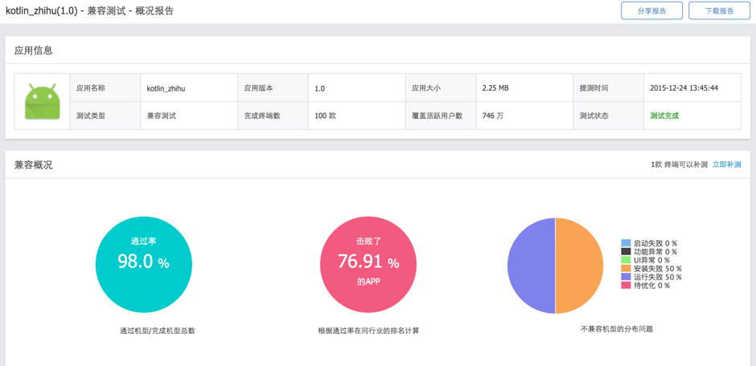

# Kotlin_zhihu

## Libraries

* [Kotlin - http://kotlinlang.org](http://kotlinlang.org)
* [Retrofit - http://square.github.io/retrofit](http://square.github.io/retrofit)
* [OkHttp - https://github.com/square/okhttp](https://github.com/square/okhttp)
* [Glide - https://github.com/bumptech/glide](https://github.com/bumptech/glide)
* [PhotoView - https://github.com/chrisbanes/PhotoView](https://github.com/chrisbanes/PhotoView)

## Introduce
一个用kotlin+java实现的知乎demo，借鉴了[ZhihuPaper](https://github.com/cundong/ZhihuPaper)， thanks @cundong

## apk

[体验包](./art/app-debug.apk)

## 兼容性测试报告

[报告地址](http://realauto.testin.cn/report.action?op=Overview.index&adaptId=aa35c794622ff4a67604402b18b375dd)，可知kotlin与android完全兼容

## Blog
[https://kotlinthree.github.io](https://kotlinthree.github.io)